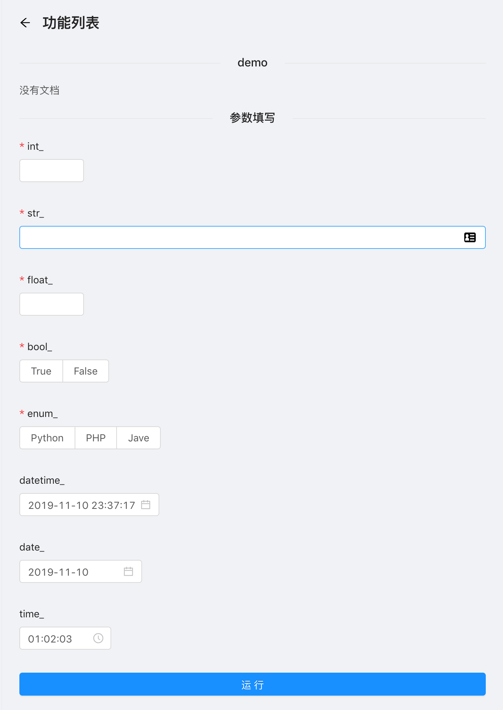
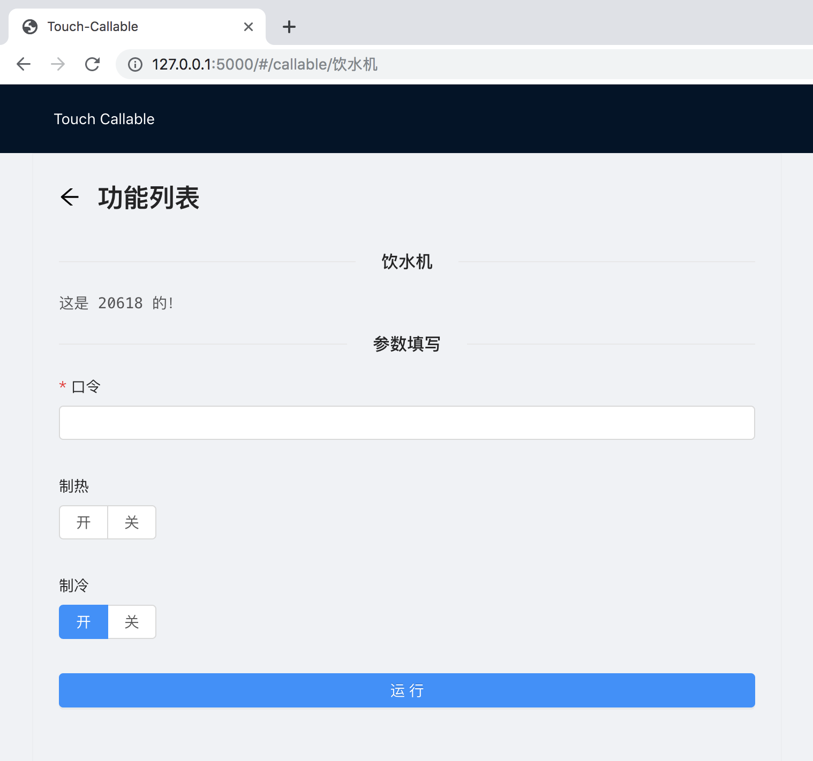

<p align="center">
  
</p>

<h1 align="center">Touch-Callable</h1>

<p>
The web framework for less serious application.

Auto generat Web UI for Python Functions.
<p>

English | [简体中文](./README_zh_CN.md)

## Support platforms

- macOS
- Ubuntu
- Windows

## Installing

Only support Python 3.6!

`pip install -U touch-callable`

## Support Function Argument types

- str
- int
- float
- bool
- datetime.datetime
- datetime.date
- datetime.time
- enum.Enum

## CommandLine args

#### `--host` 

Default is 172.0.0.1, you can only visit it on your computer.

If you want to listen all networks：

`$ touch-callable example.py --host 0.0.0.0`

#### `--port` 

Default is 6789.

#### `--debug` enable Flask debug feature(not recommend)

Default is False, if you want to enable it

`$ touch-callable example.py --debug True`

## Examples

### All support types

```python
# examply.py
from enum import Enum
from datetime import datetime, date, time


class Languages(Enum):
  Python = 'Python'
  PHP = 'PHP'
  Java = 'Java'


def demo(int_: int, str_: str, float_: float, bool_: bool,
         enum_: Languages,
         datetime_: datetime=datetime.now(),
         date_: date=date.today(),
         time_: time=time(1, 2, 3)):
  pass
```

`$ touch-callable example.py`



### Control Water Dispenser

```python
# examply.py
from enum import Enum


class 开关(Enum):
  开 = '开'
  关 = '关'


def 饮水机(口令: str, 制热: 开关=None, 制冷: 开关=开关('开')):
  """这是 20618 的！"""
  if 口令 != '多喝热水':
    raise ValueError('你是谁，我不认识你')

  # 省略具体逻辑
```

`$ touch-callable example.py`




